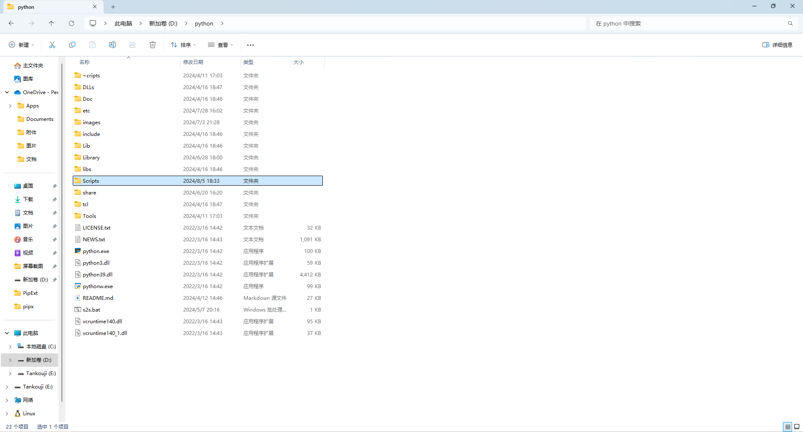
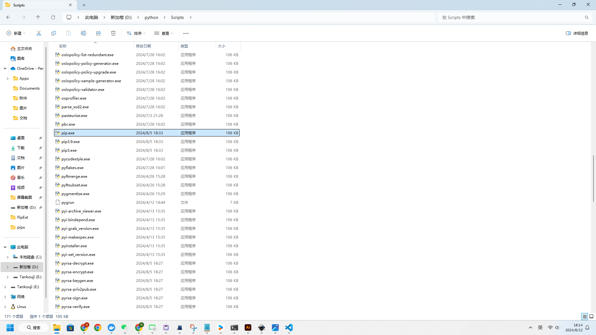

<div align="center">

# PipExtension

基于[pip源代码](https://github.com/pypa/pip)开发的pip扩展工具，继承了pip所有功能


</div>

## 安装
- 方法1：
    - 前往[releases](https://github.com/srfuture/pipExt/releases)
    - 下载对应系统的可执行程序
    - 打开python文件夹
    - 进入Scripts文件夹，使用下载的可执行程序替换pip.exe
    - Linux同理
- 方法2：
    - [下载git](https://git-scm.com/downloads)
    - 打开终端运行
    ```bash 
    git clone https://github.com/srfuture/PipExt.git
    cd PipExt
    pip install -e .[dev]
    # 注意不要删除PipExt文件夹，不然就失效了
    ```

## 扩展
> PipExt继承了所有pip方法，基本方法就不多说了，具体扩展用法请前往[更新日志](News.md)进入对应的用法文档